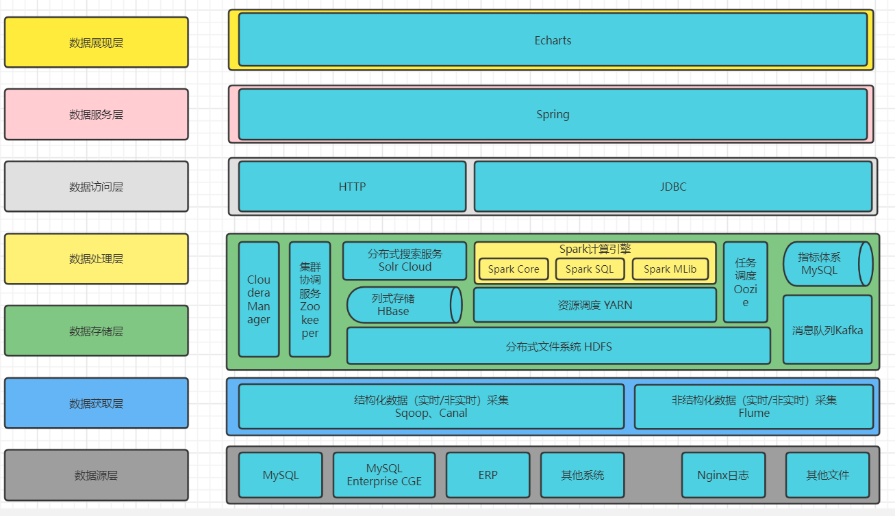
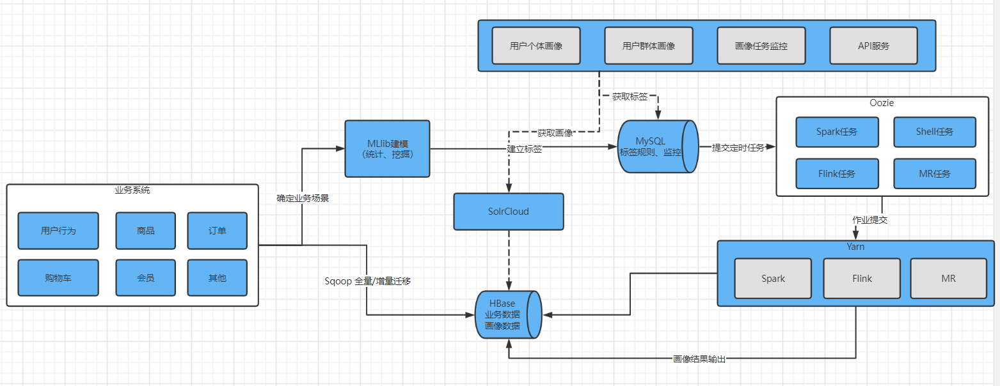
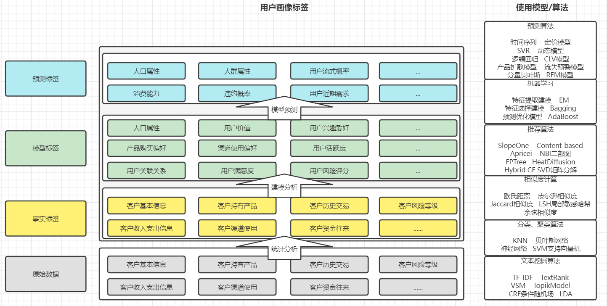

# 全域用户画像系统
通过收集用户的人口统计信息、偏好信息及行为信息等，构建出用户画像

用户画像标签
1. UserPersonal：基于用户基本信息构建标签
2. UserProfile：基于用户业务数据构建标签

目前的用户画像主要集中在三个方向：
1. 用户属性：用户基本信息标签
2. 用户偏好：基于业务数据，喜欢玩什么、看什么、买什么
3. 用户行为：基于浏览数据

标签：
1. 由原始数据，经过整理、加工、分类得到的抽象符号
2. 代表一类人的特征
3. 如：“男”就是一个标签

用户标签的常见问题：
1. 没有目标，盲目打标签：要思考标签用在哪里
2. 不区分时间状态：标签是表示“现在”、“未来”或者哪个时间段
3. 行为动机：推导需要多个维度综合判断
4. 多目标混合不清：不同类目标不混合
5. 结果缺少检验：打标-验证-积累-二次打标，持续进行迭代

用户画像的应用场景：**用户画像其实就是对用户使用标签来进行标注**
1. 精准营销
2. 数据化运营
3. 推荐系统
4. 广告投放
5. 产品布局
6. 行业报告

# 功能模块
- 标签体系
    - 基础标签：人口属性、商业属性、行为属性、用户价值
    - 组合标签：在基础标签之上按TGI创建，用于反应目标群体在特定研究范围的强势和弱势
- 标签引擎：维护标签的具体实现逻辑，数据源、规则、模型等
    - 规则和数据源管理
    - 模型管理-规则标签模型
    - 模型管理-统计标签模型
    - 模型管理-挖掘标签模型
    - 模型管理-引擎状态监控
- 画像模型
    - 个体画像：微观画像，依据用户ID：userId，查询用户所有标签，进行展示
    - 群体画像：标签查询，依据多个标签组合（OR、AND）查询用户，属于某个群体，分不同类
- 标签查询
    - 覆盖用户查询
    - 标签模型查询
- 系统设置
    - 用户管理
    - 权限管理

总体架构图：


项目功能架构图：


标签体系流程图：


# 标签梳理
## 标签定义依据
1. 用户画像的核心思想是**利用本体对用户画像中的标签进行表示、验证、推理和解释**。

本体的结构包括**类、属性、实例、公理和推理规则**

```text
1. 类：Thing为本体中所有类的父类，如酒类
2. 属性：每个类都有属性，在酒类中包括：白酒、啤酒、红酒等属性
3. 实例：指类的具体对象，如茅台酒、二锅头酒
4. 公理：本体中的永真式，描述类的约束条件，该条件在某个领域中是永远成立的，如茅台酒厂生产的就是茅台酒
5. 推理规则：本体所在领域以专家知识的形式化表示，保证本体的完整性和一致性
```

## 标签体系需求分析

标签体系是根据已注册用户的偏好、行为习惯和人口属性等不同的领域进行建立的， 按领域可以分为**人口属性、商业属性、行为属性和用户价值**四类。按具体的实现方式分为**规则标签、统计标签和挖掘标签**。 在本项目中标签体系按照业务类型划分为**基础标签和组合标签**
- 领域划分
    - 人口属性：用户的社会化特征相关标签
    - 商业属性：电商平台中购物相关的标签
    - 行为属性：电商平台中的浏览、购物等行为标签
    - 用户价值：用户资产相关标签
- 实现方式
    - 规则标签：通过匹配标签的属性值实现标签的业务逻辑
    - 统计标签：使用数学统计方法实现标签的业务逻辑
    - 挖掘标签：使用数据挖掘算法实现标签的业务逻辑
- 业务类型
    - 基础标签：性别、职业、收入等
    - 组合标签：高净值用户、80后等
  
## 标签等级划分
- 一级标签：行业
  - 金融
  - 电商
- 二级标签：子行业
  - 综合类
  - 垂直
  - 跨境电商
  - 某商场
- 三级标签
  - 人口属性
  - 商业属性
  - 行为属性
  - 用户价值
  
## 组合标签
